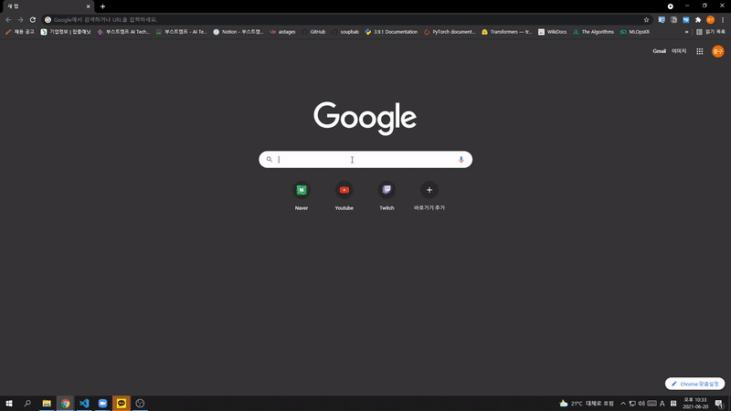

# 부스트캠프 수식인식기 크롬익스텐션

## Getting Started

### Prerequisites
부스트캠프 수식인식기 모델이 있어야 합니다.
### Install

#### Server (server 폴더)
현재 서버코드는 모델관련된 코드가 적용되어 있지 않습니다. 이 부분은 대회에서 사용하셨던 inference코드를 수정하여서 적용해주세요
```
pip install -r requirements.txt
python main.py
```

기본적으로 `a ^ { 2 } + b ^ { 2 } = c ^ { 2 }` 가 반환되도록 설정되었습니다.

#### Chrome Extension (boost_susik 폴더)
1. 위에서 서버를 시작한 다음 그에 대응하는 URL을 `content.js` 상단에 변수로 넣어주세요!
    ```
    const SERVERL_URL='http://<YOUR_SERVER_IP>:<YOUR_SERVER_PORT>/susik_recognize';
    ```
2.  크롬 주소창에 `chrome://extensions/` 다음 주소를 입력하고, `boost_susik`이라는 폴더를 `압축해제된 확장 프로그램을 로드합니다.` 버튼을 클릭하여 로드해주세요.


